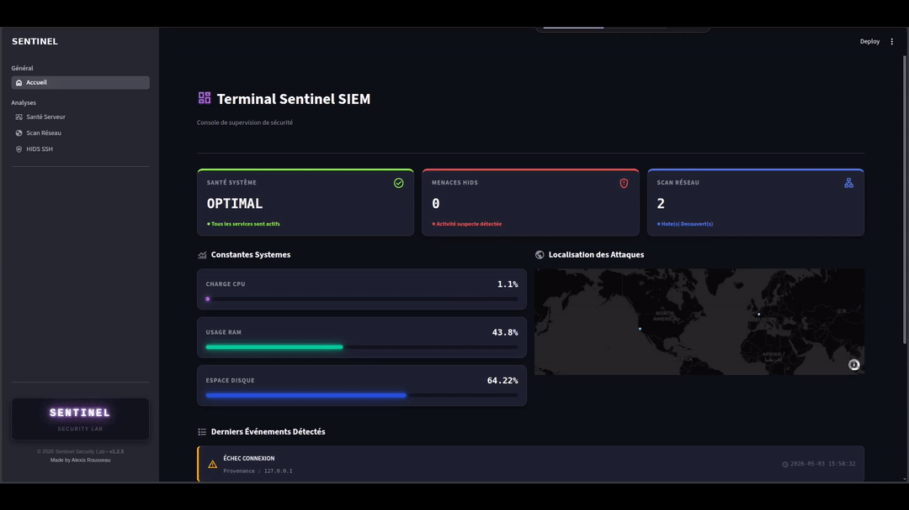
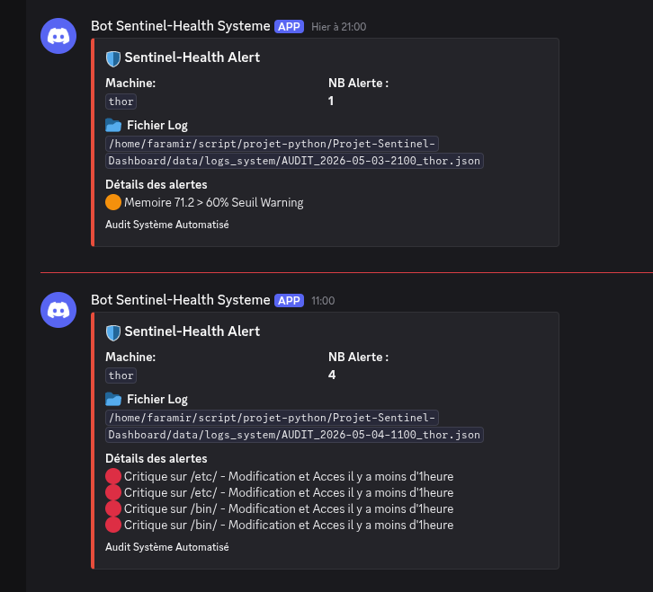
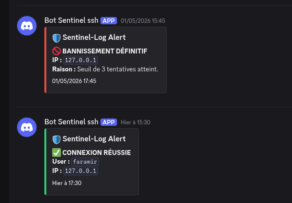

# Sentinel SIEM & HIDS


## 1. Présentation Générale
**Sentinel SIEM** est une solution légère d'analyse d'événements et de gestion de la sécurité (SIEM / HIDS) développée pour les environnements **Linux** sous **python**. Ce projet est l'aboutissement d'une suite de **projets personnels** en sécurité offensive et défensive. Il regroupe au sein d'une **interface web** unique plusieurs outils d'audit, de scan réseau et de détection d'intrusions initialement conçus comme des briques logicielles indépendantes.

L'objectif principal est de centraliser la **visibilité** de la **sécurité** d'un hôte Linux, d'automatiser l'analyse des vulnérabilités locales et réseau, et de bloquer activement les menaces en temps réel.

Ce projet est sous license **Creative Commons Attribution-NonCommercial 4.0 International (CC BY-NC 4.0)**

- **Date création du Dépot** : 04/05/2026

- **Version** : v.1.1

- **Description** : Présentation du **Projet Sentinel SIEM & HIDS**


### Aperçu de l'Interface Web


*Demonstration de l'ensemble de l'application SIEM Sentinel développé sous python*


## 2. Architecture et Évolution du Projet

Le projet Sentinel SIEM s'appuie sur une approche modulaire, issue de la fusion de quatre briques logicielles :

```
       ┌────────────────────────────────────────────────────────┐
       │                  SENTINEL SIEM (Web UI)                │
       └───┬───────────────────┬───────────────────┬────────────┘
           │                   │                   │
  ┌────────▼────────┐ ┌────────▼────────┐ ┌────────▼──────────┐
  │ Module 1: Audit │ │ Module 2: Scan  │ │ Module 3: HIDS    │
  │ Syst. & Cron    │ │ Réseau          │ │ Daemon & Netfilter│
  └─────────────────┘ └─────────────────┘ └───────────────────┘
```

## Historique de Développement
- **Projet 1** : **Audit Système Automatisé** – Script d'audit de santé système avec exécution périodique par tâche cron et alertes Discord en cas d'anomalie.

- **Projet 2** : **Scanner Réseau et Vulnérabilités** – Outil de reconnaissance réseau pour identifier les hôtes actifs, cartographier les ports et analyser les bannières de services.

- **Projet 3** : **Sentinel HIDS (Daemon)** – Service d'arrière-plan de détection et de prévention d'intrusions avec blocage IP dynamique via iptables et journalisation granulaire.

- **Projet 4 (Final)** : ***Centralisation SIEM*** – Consolidation des 3 modules précédents dans une application web unifiée pour le monitoring, la visualisation des logs et la remédiation rapide.


## 3. Fonctionnalités Détaillées
### 3.1. Dashboard Principal (Page d'Accueil)
La page d'accueil offre une vue d'ensemble de la posture de sécurité de la machine hôte :

- **Statut global** de la sécurité (alertes en cours, état des services).

- **Métriques système** générales (charge CPU, utilisation RAM, stockage).

- **Résumé de l'état** du HIDS et du réseau.




### 3.2. Module 1 : Audit Système & Gestion des Services
Ce module permet de surveiller la configuration interne de l'hôte et de détecter les anomalies de configuration système.

#### Collecte et Stockage :
Le script d'audit s'exécute périodiquement (toutes les heures) via un démon cron. Les résultats de l'analyse sont sérialisés au format JSON. L'application web charge ensuite ce fichier pour afficher les données sans surcharge système.

Pour en décourvir d'avantage sur la construction de l'audit Systeme je vous renvois à mon depot Github le concernant 

- #### [📂 Depot github - Projet Sentinel-Health : Audit Systeme Linux](https://github.com/FaramirDev/Projet-Audit-Health-Shield-Linux=)

#### Éléments Audités :
- **Ressources Système** : Utilisation CPU, RAM, et espace disque.

- **Identification de l'Hôte** : Nom de la machine, OS, version de la distribution et version de la release.

- **Gestion des Processus** : Liste des processus les plus gourmands (Top processus) avec capacité d'interruption directe (Kill Process) depuis l'interface web.

- **Analyse des Services** : Monitoring des processus (statuts up & sleep), métriques de santé des services et possibilité de démarrer, arrêter ou redémarrer un service.

- **Analyse des Chemins Critiques** (Integrité des Fichiers) : Surveillance des répertoires sensibles (/etc, /bin, /sbin, etc.) :

- **Évaluation des droits d'accès** (permissions, propriétaires).

- **Date du dernier** accès et de la dernière modification.

- **Analyse contextuelle** des permissions avec documentation intégrée (Usage normal vs Risque d'exploitation par un attaquant).


#### Système d'Alerte :
Si les seuils de sécurité sont franchis (Ex. : CPU > 75%, Disque > 80%, modification d'un fichier système critique dans la dernière heure), une alerte est transmise au serveur Discord via Webhook.




---

### 3.3. Module 2 : Scan Réseau & Cartographie
Ce module permet d'évaluer la surface d'attaque réseau de l'hôte et des machines adjacentes.

#### Collecte et Stockage :
Tout comme le module d'audit, le script de scan réseau produit des rapports au format JSON. Un historique des scans est conservé pour permettre aux administrateurs de comparer l'état du réseau dans le temps.

Pour en décourvir d'avantage sur la construction du scan réseau je vous renvois à mon depot Github le concernant 

- #### [📂 Depot github - Projet Sentinel-NetPulse Scan Network](https://github.com/FaramirDev/Projet-Audit-Network-Scanner-Linux)


#### Éléments Audités :
- **Reconnaissance Locale** : Listage complet des interfaces réseau de l'hôte et test de connectivité Internet.

- **Exécution des Scans** : Possibilité de lancer un scan complet ciblé sur une interface spécifique ou manuellement sur une plage d'adresses IP.

- **Dashboard des Résultats** :

    - **Système d'historique** permettant de recharger d'anciens scans.

    - **Synthèse graphique** (métriques) des hôtes actifs, OS détectés, ports ouverts et bannières capturées.

    - **Évaluation de la sécurité** des ports ouverts en les comparant à une liste blanche préétablie pour identifier les configurations déviantes.


---

### 3.4. Module 3 : Sentinel HIDS (Host Intrusion Detection System) :
Le HIDS de Sentinel agit comme un système de détection et de prévention d'intrusions (IPS) en analysant l'activité d'authentification sur l'hôte en temps réel.

#### Mécanisme de Blocage Netfilter :
Un démon Python s'exécute en arrière-plan pour surveiller l'ensemble des tentatives de connexion.

- En cas **d'échecs répétés** (seuil fixé à 3 tentatives), l'IP est bannie définitivement via une règle insérée dynamiquement dans iptables.

- Une **gestion par liste blanche** protège les adresses IP critiques (ex. administrateur) contre les blocages accidentels.

Pour en décourvir d'avantage sur la construction de Sentinel HIDS je vous renvois à mon depot Github le concernant 

- #### [📂 Depot github - Projet Sentinel-Defender : HIDS sous Python - Linux](https://github.com/FaramirDev/Projet-Audit-Network-Scanner-Linux)

#### Journalisation et Traçabilité : 
- **Fichiers uniques** par tentative : Un fichier d'audit granulaire est créé pour chaque tentative au format ``[ip]_status[ban|echec|succes]_[date].json.``

- **Synthèse globale** : Agrégation de la donnée pour suivre l'historique complet (IP, tentatives, utilisateur ciblé, première et dernière tentative).

#### Fonctionnalités de Visualisation Web :
- **Métriques Générales** : Volume d'IP repérées, d'IP bannies et nombre d'échecs.

- **Cartographie Géographique** : Représentation visuelle des attaquants sur une carte interactive grâce à la géolocalisation IP. Code couleur associé au niveau de risque et au statut de l'IP.

- **Logs et Filtrage** : Système de tri et de recherche multi-critères (par IP, date, statut : ban, succès, échec) avec tri chronologique.


#### Système d'Alerte :
Si le **Daemon détecte** une **connexion réussi** au system, une **alerte est automatiquement envoyé** sur le serveur Discord à l'aide du Webhook ansi qu'une **alerte si Bannissement** après 3 echecs. 



---


## 4. Architecture du projet
L'application découple totalement la **collecte de données (Backend)** de la visualisation de l'information **(Frontend)**.

```
Projet-Sentinel-Dashboard/
├── config.py              # Centralisation des chemins système et variables globales
├── core/
│   ├── sentinel_monitor_system.py       # Module Audit System 
│   ├── daemon_sentinel_hids.py          # Démon HIDS (analyse logs SSH, écritures JSON)
│   └── sentinel_scan_vulnerability.py   # Module de scan réseau (Scapy)
├── dashboard/
│   ├── sentinel_app.py    # Point d'entrée de la console SIEM (Streamlit)
│   └── pages/             # Pages spécialisées (Système, Réseau, HIDS)
├── data/                  # Fichiers de télémétrie persistants
│   ├── data_intput/       # Ensemble des Data utilisés pour les audits (whitlist, port, baseline)
│   ├── logs_hids/         # Alertes générées par le HIDS
│   ├── logs_scans/        # Resultats des scan réseau
│   └── logs_system/       # Résultats des audits systems
└── images/                # Captures d'écran et médias du projet
```

## 5. Flux de Traitement des Données
- **Collecte (Démon HIDS)** : Le script `daemon_sentinel_hids.py` s'exécute en continu comme un service système (systemd). Il écoute les logs comme /var/log/auth.log.

- **Stockage & Persistance**: Dès qu'une menace est détectée (ex: bruteforce SSH), le démon envoie un webhook Discord et écrit un fichier JSON structuré et horodaté dans data/logs_events/.

- **Analyse & Visualisation** : L'interface Streamlit lit de manière dynamique le dossier data/logs_events/, trie les alertes par ordre chronologique et les affiche à l'aide de cartes visuelles interactives.

- **Collecte de l'audit systeme** : Le script execute l'ensemble des ses fonctions et stocke l'ensemble de l'audit dans un fichier .json qui est ensuite traité par l'interface web pour afficher les données.

- **Collectre du Scan réseau** est centralisé sur le meme principe de l'audit systeme, le script effectue ses différentes fonctions puis stocke l'ensemble de ses données a travers un fichier .json qui est ensuite traité par l'interface web.

## 6. Guide d'Installation et Déploiement

Cette section détaille les étapes nécessaires pour déployer l'architecture de Sentinel SIEM sur un hôte Linux.

### 6.1. Installation des Dépendances
La solution requiert plusieurs paquets système ainsi que des bibliothèques Python spécifiques.

#### Dépendances Système

```
sudo apt update
sudo apt install python3-pip cron iptables -y
``` 
#### Dépendances Python (requirements.txt)

```
pip3 install -r requirements.txt
```

### 6.2. Configuration de l'Audit Automatisé via Cron
L'audit de sécurité système est piloté par une tâche cron qui exécute le script d'analyse toutes les heures et génère le rapport JSON d'état.

- Ouvrez la configuration crontab de l'utilisateur :

```
crontab -e
``` 

- Ajoutez la ligne suivante en bas du fichier (en adaptant le chemin absolu vers le script d'audit system) :

```
0 * * * * /usr/bin/python3 /opt/sentinel-siem/core/sentinel_monitor_system.py
``` 

### 6.3. Installation du Démon Sentinel HIDS via Systemd
Afin d'assurer une surveillance des connexions en temps réel et un blocage persistant via iptables, le module HIDS doit être configuré en tant que service système (systemd).

- Créez le fichier de service suivant dans /etc/systemd/system/sentinel-hids.service :

```
[Unit]
Description=Sentinel HIDS Daemon - Real-time Intrusion Detection and Prevention
After=network.target

[Service]
Type=simple
User=root
## (paths à ajuster)
WorkingDirectory=/opt/sentinel-siem
ExecStart=/usr/bin/python3 /opt/sentinel-siem/core/daemon_sentinel_hids.py

Restart=always
RestartSec=5

[Install]
WantedBy=multi-user.target
```

#### Activez et démarrez le démon :

```
sudo systemctl daemon-reload
sudo systemctl enable sentinel-hids.service
sudo systemctl start sentinel-hids.service
```

#### Vérifiez le statut du service :

```
sudo systemctl status sentinel-hids.service
```

### 6.4. Configuration des Privilèges Sudo
Certaines fonctionnalités de Sentinel SIEM nécessitent des privilèges élevés pour interagir directement avec les couches réseau et noyau du système d'exploitation.

#### Actions requérant des droits d'administration (root via sudo) :

- **Scan Réseau** : L'analyse avancée des hôtes, la détection des OS et la capture de bannières via des paquets bruts (Raw Sockets).

- **Gestion des Services** : Les actions d'administration système telles que le démarrage, l'arrêt ou le redémarrage de services locaux.

- **Sentinel HIDS** : L'insertion de règles de bannissement dynamiques au sein de la table de filtrage iptables.

Pour permettre à l'application web d'exécuter ces commandes sans compromettre la sécurité globale de l'hôte, une configuration spécifique des droits sudoers est requise pour l'utilisateur exécutant l'application.

### 6.5 Configuration des WEBHOOB Discord
Nomenclature à respecter pour la gestion d'Alerte via les Webhooks Discord :

- Creation du fichier `.env` à la racine du projet

    - Pour l'**alerte de l'Audit System**, utilisé la **variable** = `DISCORD_WEBHOOK_URL_SYSTEM`
    - Pour l'**alerte via HIDS**, utilisé la **variable** = `DISCORD_WEBHOOK_URL_HIDS`


### 6.7. Lancement de l'Application Web
Une fois l'ensemble des modules configurés, l'interface web du SIEM peut être démarrée.

- Exécutez l'application via Python à la **racine du projet** :

```
streamlit run dashboard/sentinel_app.py
```
Par défaut, l'interface va s'ouvrir automatique en local sur le port associés : http://127.0.0.1:5000 

## 7. Conclusion et Perspectives
Le projet **Sentinel SIEM** démontre la faisabilité d'une solution de **sécurité centralisée**, **légère** et **efficace** pour les environnements **Linux**. En unifiant des scripts d'audit système, un scanner réseau et un HIDS dynamique au sein d'une interface web unique, ce projet répond à une problématique concrète : simplifier la visibilité et la remédiation face aux incidents de sécurité.

L'implémentation de mécanismes d'automatisation (tâches cron, démon système en temps réel), de blocage actif via le noyau (iptables) et de notification instantanée (Discord) offre une protection proactive plutôt que simplement réactive.

### Évolutions futures (Roadmap)
Afin de faire évoluer la solution vers un niveau de production industrielle, plusieurs pistes d'amélioration sont envisagées :

- **Détection avancée des intrusions (HIDS)** : Intégration de l'analyse heuristique et comportementale pour identifier les scans de ports lents (low-and-slow) ou les attaques par force brute distribuées.

- **Architecture Distribuée** : Transition vers un modèle Agent-Serveur pour permettre à une instance centrale de Sentinel SIEM de surveiller un parc entier de serveurs Linux distants.

- **Conteneurisation et Orchestration** : Dockerisation complète de l'application web et de ses modules pour simplifier son déploiement via Kubernetes.

- **Richesse des Alertes** : Diversification des canaux de notification (alertes par e-mail, intégration avec des outils de ticketing comme Jira ou des outils de communication comme Slack).

- **Ajout de service** : Ajouter/Modifier/Supprimé des services présent dans la whitlist de service à suivre depuis l'interface web.

- **Réalisation d'une Documentation complète** : Prochainement sur l'étape suivante lors de la Dockerisation de l'application.

---

## Licence
Ce projet est sous licence **Creative Commons Attribution-NonCommercial 4.0 International (CC BY-NC 4.0)**.
Toute utilisation commerciale est strictement interdite sans autorisation préalable. Consultez le fichier [LICENSE](./LICENSE) pour plus de détails.

---
**Auteur** : Alexis Rousseau | Ingénieur & Administrateur Systeme Réseau Cybersécurité

**Date Création dépot** : 04/05/2026

**Version** : 1.1

**Contact** : alexisrousseau.work@proton.me